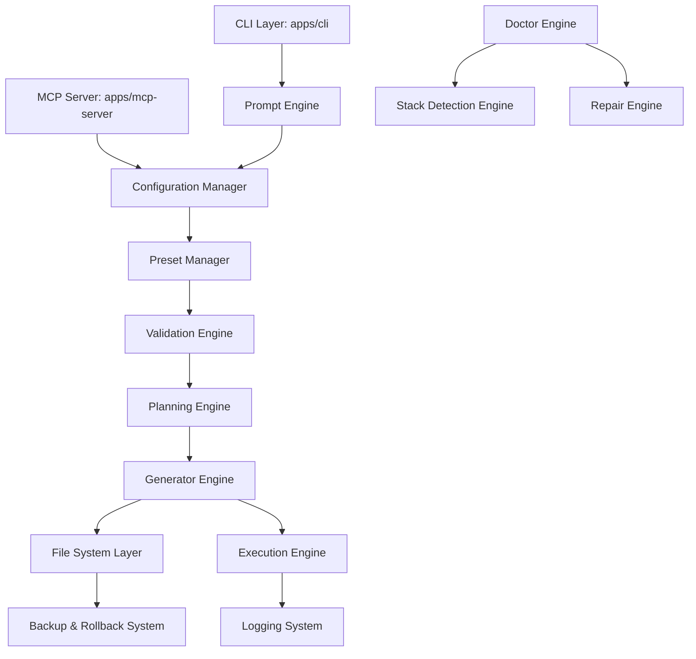

# Architecture Guide

## Phase 7 Extension Platform

Phase 7 adds the Event Bus, Hook System, Plugin SDK, Generator SDK, Template SDK, Module SDK, and manifest metadata. Generation still produces the same MVP starter projects, but the internal flow now routes through built-in plugins, generator registries, template descriptors, hooks, and typed lifecycle events.

The default workflow is npm-first. New examples, generated next steps, and verification commands use `npm install`, `npm run build`, `npm test`, and `npm run verify:phase-7`.

## Phase 8 Platform Maturity

Phase 8 adds Template Inheritance, Template DSL rendering, Virtual File Graph validation, Project Diff previews, Transaction Engine semantics, Dependency Graph resolution, Generator Composition, Plugin Sandbox boundaries, Event Persistence, and expanded read-only MCP tool contracts.

This document describes the high-level architecture of Structify, detailing its subsystems, boundaries, and how they communicate.



## Subsystem Architecture

Structify is split into modular subsystems to maximize maintainability, scalability, and testability.

### 1. CLI Layer (`apps/cli`)

- **Responsibility**: Serves as the primary CLI entrypoint. Parses commands, routes options, prints formatted console output, and provides interactive terminal prompts.
- **Communication**: Invokes the Prompt Engine to gather user parameters or the Configuration Manager to load preset files. Passes selections to the Planning Engine.

### 2. Prompt Engine

- **Responsibility**: Displays interactive lists, inputs, and confirmations to gather project parameters (language, framework, database, styling, packages).
- **Communication**: Queries the Validation Engine to dynamically enable or disable choices based on compatibility matrices.

### 3. Validation Engine

- **Responsibility**: Checks if a given stack combination is valid. Evaluates technical limitations (e.g., PostgreSQL requires Prisma or another SQL driver, and cannot pair with Mongoose).
- **Communication**: Invoked by the Prompt Engine during parameter gathering and by the Planning Engine during step generation.

### 4. Planning Engine

- **Responsibility**: Converts a validated Stack Configuration into a list of logical steps called the Project Plan.
- **Communication**: Evaluates required modules and creates a sequence of actions (e.g., `CreateFolder`, `WriteFile`, `RunCommand`) before any modifications are executed.

### 5. Execution Engine

- **Responsibility**: Sequentially executes the steps defined in the Project Plan. Runs package installation, initial test executions, and git commands.
- **Communication**: Integrates with the Logging System to record outputs and works hand-in-hand with the File System Layer to ensure rollbacks occur on execution failure.

### 6. Generator Engine (`packages/generators`)

- **Responsibility**: Houses framework-specific templates and generation utilities.
- **Communication**: Invoked by the Planning Engine to compile file structures, configuration templates, and scaffolding options.

### 7. File System Layer

- **Responsibility**: Abstracted file wrapper providing safe write operations. Detects write conflicts, generates temporary backups, and performs atomic file operations.
- **Communication**: Backs up target files prior to execution and triggers rollbacks in case of tool failure.

### 8. Configuration Manager

- **Responsibility**: Parses and validates Structify configuration files (`structify.json`) and handles workspace context detection.
- **Communication**: Provides loaded settings to the Preset Manager.

### 9. Preset Manager

- **Responsibility**: Stores and retrieves reusable configurations (presets). Allows developers to save complex combinations (e.g., "production-nextjs-postgres") to quickly recreate stacks.
- **Communication**: Validates preset files against strict JSON schemas and returns them to the CLI Layer or MCP Server.

### 10. Module Manager

- **Responsibility**: Supports adding specific modules (e.g., "auth", "docker", "testing") to an existing project generated by Structify.
- **Communication**: Re-analyzes the existing project stack using the Stack Detection Engine and plans module insertion.

### 11. Template Engine

- **Responsibility**: Compiles configuration files and boilerplate templates using variables (e.g., injecting the project name, database host, or styling choices).
- **Communication**: Invoked by generators to build file contents dynamically.

### 12. Stack Detection Engine

- **Responsibility**: Analyzes an existing project directory (`package.json`, source files, and configs) to identify current framework, database, and package choices.
- **Communication**: Feeds detected stack settings to the Doctor Engine and Module Manager.

### 13. Doctor Engine

- **Responsibility**: Inspects a project to identify configuration issues, missing files, misaligned dependencies, or broken scripts.
- **Communication**: Scans the project filesystem and lists issues. Suggests specific Repair Actions.

### 14. Repair Engine

- **Responsibility**: Safely executes fix operations recommended by the Doctor Engine.
- **Communication**: Uses the Planning and Execution engines to execute corrective steps (e.g., rewriting lint configurations, adding missing husky hooks).

### 15. Logging System

- **Responsibility**: Captures CLI progress, warnings, errors, and diagnostic outputs. Supports multiple output formats (colored terminal text, JSON logs).
- **Communication**: Centralized logger used across all subsystems.

### 16. Testing Layer

- **Responsibility**: A comprehensive suite of unit tests, integration tests, and platform-specific tests (Windows, macOS, Linux).
- **Communication**: Evaluates all subsystems under mock and live file systems.

### 17. MCP Server (`apps/mcp-server`)

- **Responsibility**: Implements the Model Context Protocol. Exposes Structify commands as tools directly to AI coding assistants.
- **Communication**: Interacts with the shared core packages (`packages/core`) to run validations, plans, generators, and doctors.

---

## Monorepo Architecture

Structify uses a monorepo structure to organize resources. This centralizes shared packages and separates execution layers.

```
structify/
├── apps/
│   ├── cli/                   # Interactive CLI Application
│   └── mcp-server/            # Model Context Protocol Server
├── packages/
│   ├── core/                  # Core planning, validation, and file-system logic
│   ├── generators/            # Framework scaffolding and file templates
│   └── shared-utils/          # General helper functions and typings
├── docs/                      # Blueprints, guides, and specifications
└── package.json               # Monorepo workspaces definition
```

### Why a Monorepo?

1. **Shared Logic**: The MCP Server and CLI must execute identical validation and planning rules. Placing this logic in `packages/core` avoids duplicating code.
2. **Modular Upgrades**: Generator templates and config engines can be updated independently of the CLI interface.
3. **Simultaneous Testing**: Integration tests can verify generators, CLI command routing, and the MCP server in a single test run.
