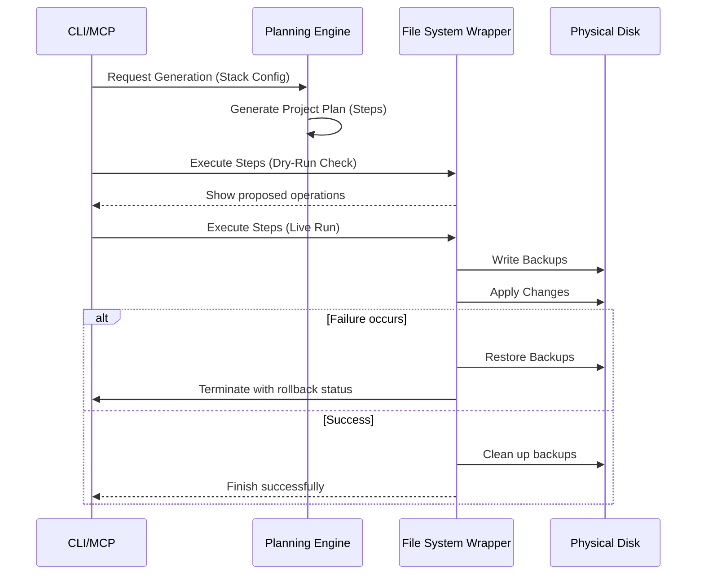

# Generator Architecture

This document describes the template generation workflow, step structure, and transactional safety guidelines (backup/rollback actions) that Structify uses to ensure safe file operations.

---

## The Project Plan and Execution Step Lifecycle

Before executing any updates to the filesystem, the Planning Engine outputs a **Project Plan** consisting of discrete **Execution Steps**.



---

## Execution Step Structure

Every operation is represented as a structured object:

```typescript
interface ExecutionStep {
  id: string;
  type: 'CreateFolder' | 'WriteFile' | 'AppendFile' | 'RunCommand' | 'DeleteFile';
  targetPath: string;
  content?: string; // For file writes
  commandLine?: string; // For execution steps
  description: string;
}
```

---

## Safe Execution & Rollback System

The File System Layer is responsible for handling changes safely:

1. **Transactional Buffer**:
   - Before modifying any file (e.g. overwriting a `.gitignore`), the File System Layer writes the original file to a temporary backup directory (`.structify-backups/`).
   - If the file did not exist previously, a record of its absence is logged.
2. **Execution Log**:
   - Tracks every step completed during execution.
3. **Rollback Trigger**:
   - If a package installation fails or a file cannot be written due to a permission error, the Execution Engine pauses.
   - It iterates through the Execution Log in reverse order:
     - Deletes any newly created files.
     - Restores original files from the `.structify-backups/` directory.
     - Removes empty folders created during generation.
   - Ensures the workspace is left in its initial state.
4. **Cleanup**:
   - Upon successful execution, the `.structify-backups/` directory is deleted.
