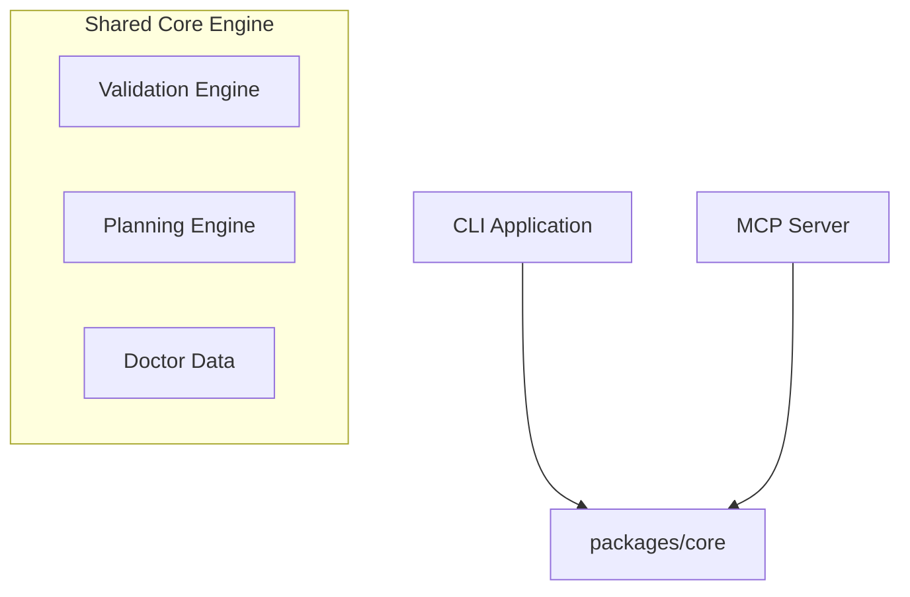

# Model Context Protocol (MCP) Documentation

This document describes how Structify integrates with the Model Context Protocol (MCP) to allow AI coding assistants to validate, plan, inspect, and preview Structify projects.

---

## MCP Architecture & Shared Core

To prevent duplicating business logic, both the **CLI Layer** (`apps/cli`) and the **MCP Server** (`apps/mcp-server`) depend on the shared core (`packages/core`).

By packaging validation rules, template planning, and metadata inspection in the core module, the MCP server serves as a lightweight interface wrapper.

---

## MCP Tools

The `apps/mcp-server` exposes read-only helper functions for:

- `list_supported_stacks`
- `validate_config`
- `create_plan`
- `preview_diff`
- `inspect_project`
- `list_generators`
- `list_templates`
- `list_plugins`
- `list_modules`
- `list_events`
- `doctor`

MCP generation, repair, and mutation workflows are intentionally not enabled in this stabilization baseline.
